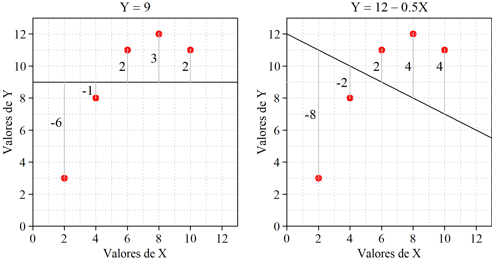

# Regresión

## Definiciones

Residuos

Normalidad de la respuesta

Estimación de los parámetros

Modelo, no ecuación

## Determinación de la recta ajustada

Se realiza con el objetivo de minimizar la suma de los cuadrados de los residuos. Pero existen otros métodos. Veamos algunos.

### A ojo {.unnumbered}

Se traza la recta directamente sobre el papel o se identifican dos puntos de paso y a partir de ellos se calculan los coeficientes del modelo.

+--------------------------------------------------------------------------------+----------------------------------------------------------------------------------------+
| **PROS** <i class="fa-solid fa-thumbs-up fa-xl" style="color: #0ca701;"></i>   | -   Intuitivo. Muy fácil de entender                                                   |
|                                                                                | -   No se comenten errores de mucho bulto                                              |
+--------------------------------------------------------------------------------+----------------------------------------------------------------------------------------+
| **CONS** <i class="fa-solid fa-thumbs-down fa-xl" style="color: #f03333;"></i> | -   No se logra el ajuste "perfecto" de acuerdo con el criterio establecido            |
|                                                                                | -   No se tienen medidas de calidad del ajuste ni de significación de los coeficientes |
|                                                                                | -   Solo sirve para regresión simple                                                   |
+--------------------------------------------------------------------------------+----------------------------------------------------------------------------------------+

: {tbl-colwidths="\[10,90\]"}

A pesar de sus evidentes limitaciones, si solo se trata de tener la recta no es un método tan malo como parece. Con un poco de práctica el ajuste no será muy distinto del "perfecto" y no se cometeran errores de mucho bulto debido a la presencia de valroes anómalos, cosa que sí puede ocurrir si se tratan los datos de forma automática sin mnirarlos.

### Método de Ishikawa {.unnumbered}

+--------------------------------------------------------------------------------+---------------------------------------------------------------------------------+
| **PROS** <i class="fa-solid fa-thumbs-up fa-xl" style="color: #0ca701;"></i>   | -   Fácil de entender                                                           |
|                                                                                | -   Robusto frente a la presencia de valores anómalos o con excesiva influencia |
+--------------------------------------------------------------------------------+---------------------------------------------------------------------------------+
| **CONS** <i class="fa-solid fa-thumbs-down fa-xl" style="color: #f03333;"></i> | -   No se tienen medidas de calidad del ajuste                                  |
|                                                                                | -   Solo sirve para regresión simple                                            |
+--------------------------------------------------------------------------------+---------------------------------------------------------------------------------+

: Método de Ishikawa. Ventajas e inconvenientes {#tbl-letters} : {tbl-colwidths="\[10,90\]"}

### Minimizando la suma de los residuos {.unnumbered}

Entendemos que se trata de minimizar la suma en valor absoluto, ya que un valor muy grande con signo negativo se logra simplemente aumentando los valores de $b_0$ y/o de $b_1$. Por tanto, se trata de minimizar $|\sum(Y_i - (b_0 - b_1 X_i))|$. Haciendo esta expresión igual a cero (mínimo valor posible), tenemos:

$$ n\bar{Y} - nb_0 - b_1 n \bar{X} = 0$$ Por tanto, con cualquier par de valores $b_0$ y $b_1$ que verifiquen la expresión $\bar{Y} = b_0 + b_1 \bar{X}$, es decir, con cualquier recta que pase por ($X_0$, $Y_0$) tendremos una suma de residuos en valor absoluto igual a cero.

Que haya infinitas rectas que cumplan esa condición ya es mala señal, porque seguro que no todas son adecuadas. Para los valores representados en la figura X tenemos que $\bar{X}= 6$ y $\bar{Y}= 9$. Rectas que cumplen la condicion de minimizar la suma de los residuos son, por ejemplo, la que tiene coeficientes $b_0=9$ y $b_1=0$, es decir: $Y = 9$, o también $b_0 = 12$ y $b_1 = -0.5$, es decir: $Y = 12 -0.5X$.

{#fig-sumaCero fig-align="center" width="100%"}

+--------------------------------------------------------------------------------+-----------------------------------------------------------------------------------------------------+
| **PROS** <i class="fa-solid fa-thumbs-up fa-xl" style="color: #0ca701;"></i>   | -   Ninguna                                                                                         |
+--------------------------------------------------------------------------------+-----------------------------------------------------------------------------------------------------+
| **CONS** <i class="fa-solid fa-thumbs-down fa-xl" style="color: #f03333;"></i> | -   Da un número infinito de soluciones (una de ellas coincide con el ajuste por mínimos cuadrados) |
+--------------------------------------------------------------------------------+-----------------------------------------------------------------------------------------------------+

: Minimizar la suma de los residups. Ventajas e inconvenientes {#tbl-letters} : {tbl-colwidths="\[10,90\]"}

### Minimizando la suma de los residuos en valor absoluto {.unnumbered}

De entrada parece bastante más razonable que el anterior. Puede no tener solución única, pero los resultados que da no son disparados como en el caso anterior \***referencia a figura\***. Tiene solución única pero no existen expresiones para los coeficientes debido a las dificultades en el manejo de la función "valor absoluto".

{fig-align="center" width="100%"}

Mas información: [Wikipedia](abline(out$coefficients%5B1%5D,%20out$coefficients%5B2%5D) "Más información")

### Minizando la suma de los cuadrados de los residuos {.unnumbered}

aquí texto

{fig-align="center" width="100%"}

## Mínimos cuadrados. Cálculo de los coeficientes

Aquí texto

### Con fuerza bruta {.unnumbered}

### Usando las expresiones de $b_0$ y $b_1$ que minimizan la suma de los cuadrados de los residuos {.unnumbered}

Curiosidad con el redondeo

See @knuth84 for additional discussion of literate programming.
