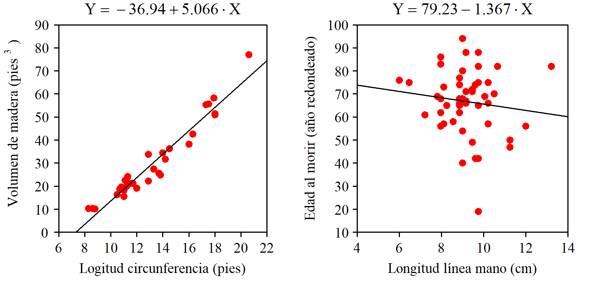

# Regresión Simple

## Definiciones

Residuos

Normalidad de la respuesta

Estimación de los parámetros

Modelo, no ecuación

Regresión simple vs. múltiple

## Determinación de la recta ajustada

Se realiza con el objetivo de minimizar la suma de los cuadrados de los residuos. Pero existen otros métodos. Veamos algunos.

### A ojo {.unnumbered}

Se traza la recta directamente sobre el papel o se identifican dos puntos de paso y a partir de ellos se calculan los coeficientes del modelo.

A pesar de sus evidentes limitaciones, si solo se trata de tener la recta no es un método tan malo como parece. Con un poco de práctica el ajuste no será muy distinto del "perfecto" y no se cometeran errores de bulto debido a la presencia de valores anómalos, cosa que sí puede ocurrir si se tratan los datos de forma automática sin mnirarlos.

{#fig-sumaCero fig-align="right" width="100%"}

+--------------------------------------------------------------------------------+----------------------------------------------------------------------------------------+
| **PROS** <i class="fa-solid fa-thumbs-up fa-xl" style="color: #0ca701;"></i>   | -   Intuitivo. Muy fácil de entender                                                   |
|                                                                                | -   No se comenten errores de mucho bulto                                              |
+--------------------------------------------------------------------------------+----------------------------------------------------------------------------------------+
| **CONS** <i class="fa-solid fa-thumbs-down fa-xl" style="color: #f03333;"></i> | -   No se logra el ajuste "perfecto" de acuerdo con el criterio establecido            |
|                                                                                | -   No se tienen medidas de calidad del ajuste ni de significación de los coeficientes |
|                                                                                | -   Solo sirve para regresión simple                                                   |
+--------------------------------------------------------------------------------+----------------------------------------------------------------------------------------+

: {tbl-colwidths="\[10,90\]"}

### Método de Ishikawa {.unnumbered}

Aquí texto,

{#fig-Ishikawa fig-align="right" width="100%"}

+--------------------------------------------------------------------------------+---------------------------------------------------------------------------------+
| **PROS** <i class="fa-solid fa-thumbs-up fa-xl" style="color: #0ca701;"></i>   | -   Fácil de entender                                                           |
|                                                                                | -   Robusto frente a la presencia de valores anómalos o con excesiva influencia |
+--------------------------------------------------------------------------------+---------------------------------------------------------------------------------+
| **CONS** <i class="fa-solid fa-thumbs-down fa-xl" style="color: #f03333;"></i> | -   No se tienen medidas de calidad del ajuste                                  |
|                                                                                | -   Solo sirve para regresión simple                                            |
+--------------------------------------------------------------------------------+---------------------------------------------------------------------------------+

: Método de Ishikawa. Ventajas e inconvenientes {#tbl-letters} : {tbl-colwidths="\[10,90\]"}

### Minimizando la suma de los residuos {.unnumbered}

Entendemos que se trata de minimizar la suma en valor absoluto, ya que un valor muy grande con signo negativo se logra simplemente aumentando los valores de $b_0$ y/o de $b_1$. Por tanto, se trata de minimizar $|\sum(Y_i - (b_0 - b_1 X_i))|$. Haciendo esta expresión igual a cero (mínimo valor posible), tenemos:

$$ n\bar{Y} - nb_0 - b_1 n \bar{X} = 0$$ Por tanto, con cualquier par de valores $b_0$ y $b_1$ que verifiquen la expresión $\bar{Y} = b_0 + b_1 \bar{X}$, es decir, con cualquier recta que pase por ($X_0$, $Y_0$) tendremos una suma de residuos en valor absoluto igual a cero.

Que haya infinitas rectas que cumplan esa condición ya es mala señal, porque seguro que no todas son adecuadas. Para los valores representados en la figura X tenemos que $\bar{X}= 6$ y $\bar{Y}= 9$. Rectas que cumplen la condicion de minimizar la suma de los residuos son, por ejemplo, la que tiene coeficientes $b_0=9$ y $b_1=0$, es decir: $Y = 9$, o también $b_0 = 12$ y $b_1 = -0.5$, es decir: $Y = 12 -0.5X$.

{#fig-sumaVAbsoluto fig-align="center" width="100%"}

+--------------------------------------------------------------------------------+-----------------------------------------------------------------------------------------------------+
| **PROS** <i class="fa-solid fa-thumbs-up fa-xl" style="color: #0ca701;"></i>   | -   Ninguna                                                                                         |
+--------------------------------------------------------------------------------+-----------------------------------------------------------------------------------------------------+
| **CONS** <i class="fa-solid fa-thumbs-down fa-xl" style="color: #f03333;"></i> | -   Da un número infinito de soluciones (una de ellas coincide con el ajuste por mínimos cuadrados) |
+--------------------------------------------------------------------------------+-----------------------------------------------------------------------------------------------------+

: Minimizar la suma de los residups. Ventajas e inconvenientes {#tbl-letters} : {tbl-colwidths="\[10,90\]"}

### Minimizando la suma de los residuos en valor absoluto {.unnumbered}

De entrada parece bastante más razonable que el anterior. Puede no tener solución única, pero los resultados que da no son disparados como en el caso anterior \***referencia a figura\***. Tiene solución única pero no existen expresiones para los coeficientes debido a las dificultades en el manejo de la función "valor absoluto".

{fig-align="center" width="100%"}

Mas información: [Wikipedia](abline(out$coefficients%5B1%5D,%20out$coefficients%5B2%5D) "Más información")

### Minizando la suma de los cuadrados de los residuos {.unnumbered}

aquí texto

{#fig-sumaCuadrados fig-align="center" width="100%"}

## Mínimos cuadrados. Cálculo de los coeficientes

Aquí texto

### Con fuerza bruta {.unnumbered}

Podemos hacer una primera estimación de los coeficientes a ojo y a continuación, mediante un pequeño programa -o también usando una hoja de cálculo-, realizar un barrido de los valores de $b_0$ y $b_1$ en torno a los estimados, identidicando el par que minimiza la suma de los cuadrados de los residuos.

Natrualmente, es mucho más rápido y más práctico echar mano de las fórmulas de los coeficientes o -mejor todavía- usar un paquete de software o una hoja de cálculo, pero hacerlo a mano permite entender perfectamente qué es lo que se está haciendo, y también descubrir algún detalle interesante.

Vayamos a los datos de la figura @fig-sumaCero (que son también los de @fig-Ishikawa). Hemos trazado la recta ajustada a ojo de manera que pasa por los puntos (-4,75; 0) y (5,75, 60) por lo que sus coeficientes son: $b_1$ = 5,71 y $b_0$ = 27,14. Sería mucha casualidad que esos fueran los valores exactos que estamos buscando, pero no andarán muy lejos. Vamos a crear una malla de valores de $b_0$ y $b_1$. Los valores de $b_0$ variarán de 2 a 8 con incrementos de 0,1 y para cada uno de esos, los de $b_0$ irán de 20 a 35 también en saltos de 0,1. A cada combinación de esos dos valores corresponde a una recta, y a cada recta una suma de los cuadrados de los residuos. El par de valores que minimizan esa suma de cuadrados son: $b_0$ = 27,0 y $b_1$ = 4,8. Ver figura @fig-fuerzaBruta.

{#fig-fuerzaBruta fig-align="center" width="100%"}

::: callout-note
## Paraboloide de la suma de cuadrados

Con los datos de nuestro ejemplo, la superficie que representa la suma de los cuadrados de los residuos es un paraboloide donde la localización del mínimo es visulamente muy clara. Pero lo nomal es que las curvas de nivel sean muy elípticas de manera que la representación no queda tan clara. Nosotros hemos logrado esa forma regular haciendo que la media de los valores de $X$ sea igual a cero. De esta forma, los coeficientes son independientes y las curvas de nivel apararecen como círculos prácticamente concéntricos quedando más clara la idea que queremos representar.
:::

### Usando las fórmulas {.unnumbered}

En el diagrama que representa la relación entre $X$ e $Y$ cada punto puede ser identificado por sus coordenadas $(x_i, y_i)$ con $1 \leq i \leq n$ siendo $n$ el número total de puntos.

Cada uno de los puntos tiene un residuo asociado y ese residuo es la diferencia entre el valor real de $y$, es decir, $y_i$ y su valor estimado, el que estará sobre la recta y que será igual a $b_0 + b_1 x_i$. Por tanto, el valor del residuo asociado al punto $i$ lo podemos escribir de la forma:

$$ y_i - \left( b_0 + b_1 x_i \right) $$ Por tanto, la suma de los cuadrados de los residuos, $S$, será:

$$ S = \sum_{í=1}^n \left(y_i - b_0 - b_1 x_i \right )^2 $$ Tanto los valores de $y_i$ como los de $x_i$ vienen dados. La suma de cuadrados $S$ es función de los valores de $b_0$ y de $b_1$ y podemos escribir $S \left(b_0, b_1 \right )$ y se trata de hallar los valores de $b_0$ y de $b_1$ que minimizan la suma de cuadrados. El mínimo lo tendremos en el punto en que la derivada de $S \left(b_0, b_1 \right )$ respecto a $b_0$ y respecto a $b_1$ es igual a cero. También habrá que verificar que es un mínimo comprobando que la segunda derivada es un valor positivo.

$$ \frac{\partial S}{\partial b_0} = -2 \sum_{í=1}^n \left(y_i - b_0 - b_1 x_i \right ) $$ $$ \frac{\partial S}{\partial b_1} = -2 \sum_{í=1}^n \left(y_i - b_0 - b_1 x_i \right ) x_i $$ Igualando a cero estas expresiones:

$$ \sum_{í=1}^n y_i - nb_0 - b_1 \sum_{í=1}^n x_i = 0 $$ {#eq-derivada_b0}

$$ \sum_{í=1}^n x_i y_i - b_0 \sum_{í=1}^n x_i - b_1 \sum_{í=1}^n  x_i^2  = 0 $$ {#eq-derivada_b1}

Dividiendo por $n$ todos los términos de la ecuación [-@eq-derivada_b0] tenemos:

$$ b_0 = \bar{y} - b_1 \bar{x} $$

::: callout-note
## La recta ajustada pasa por el punto $(\bar{x}, \bar{y})$

De la anterior expresón para $b_0$ también se decude que $\bar{y} = b_0 + b_1\bar{x}$. Es decir, la recta ajustada minimizando la suma de los cuadrados de los residuos siempre pasa por el punto $(\bar{x}, \bar{y})$ .
:::

Sustituyendo la expresión de $b_0$ en la ecuación [-@eq-derivada_b1] tenemos:

$$ \sum_{í=1}^n x_i y_i - \bar{y} \sum_{í=1}^n x_i +  b_1\bar{x} \sum_{í=1}^n x_i- b_1 \sum_{í=1}^n  x_i^2  = 0 $$ Para aligerar la notación no pondremos los límites a los sumatorios, que siempre son desde $i=1$ hasta $n$. Despejando $b_1$ llegamos a:

$$ b_1 = \frac{\sum x_i y_i - \bar{y} \sum x_i}{\sum x_i^2 - \bar{x} \sum x_i} $$ También la expresión de $b_1$ se suele dar de la forma:

$$ b_1 = \frac{\sum (x_i - \bar{x})(y_i - \bar{y})}{\sum (x_i - \bar{x})^2} $$ {#eq-expresion_b1} Las dos expresiones son equivalentes ya que en el numerador:

```{=tex}
\begin{equation}
\begin{split}
\sum (x_i - \bar{x})(y_i - \bar{y}) &= \sum x_i y_i - \bar{x} \sum y_i - \bar{y} \sum x_i + n\bar{x}\bar{y} =\\\\
                                    &= \sum x_i y_i -2n\bar{x}\bar{y} + n\bar{x}\bar{y} =\\\\
                                    &= \sum x_i y_i -n\bar{x}\bar{y} = \sum x_i y_i - \bar{y} \sum x_i
\end{split}
\end{equation}
```
y en el denominador:

```{=tex}
\begin{equation}
\begin{split}
\sum (x_i - \bar{x})^2 &= \sum x_i^2 - 2 \bar{x} \sum x_i + n \bar{x}^2 =\\\\
                                    &= \sum x_i^2 -n\bar{x}^2 = \sum x_i^2 - \bar{x} \sum x_i
\end{split}
\end{equation}
```
Finalmente, a partir de la ecuación [-@eq-expresion_b1] y recordando las expresiones de la covarianza y del coeficiente de correlación, llegamos a una expresión que también se ve con frecuencia en los libros de texto, seguramente porque una calculadora sencilla da directamente los tres valores que intervienen:

$$ b_1 = \frac{Cov(XY)}{s_X^2} = \frac{r_{XY} s_X s_Y}{s_X^2} = r_{XY} \frac{s_Y}{s_X} $$ Calculando los coeficientes que corresponden a los datos de la figura [-@fig-fuerzaBruta] se obtiene:

$$ b_0 = 26,9615 \qquad  \qquad b_1 = 4,8616 $$

## Calidad del ajuste

Observe los siguientes modelos ajustados:

$$ y = -36,94 + 5.066 X $$
$$ y = 79.23 - 1.367 X $$
¿Cuál le parece más util para explicar la relación entre las dos varibles? Solo a la vista del modelo ajustado es imposible saber si ese modelo representa la relación entre las variables consideradas o si no sirve para nada porque entre esas variables no hay ninguna relación.

En gráfico de la izquierda de la figura [-@fig-ArbolMano] muestra la relación entre la longitud de la circunferencia de los troncos de un determinado tipo de arbol y el volumen de madera que se puede obtener de ellos [Fuente: @WolframData2016]. Se observa que a más circunferencia mayor volumen de madera se obtiene (tal como era de esperar) y la ecuación obtenido es útil para estimar el volumen de madera que se obtendrá de un tronco de determinado diámetro. Sin embargo, el gráfico de la derecha se ha realizado con los datos de un estudio publicado por @Wilson74 citado por @Draper98 donde -a partir de una muestra de 50 difuntos- se analiza la relación entre la edad al morir y la longitud de cierta línea de la mano. A la vista del diagrama queda claro que no hay ninguna relación entre ambas variables y el modelo ajustado no seirve absolutamente para nada. Pero los dos modelos tienen exactamente el mismo aspecto y solo a la vista de su expresión es imposible saber cual de los dos es útil.

{#fig-ArbolMano fig-align="center" width="100%"}

Hace falta, por tanto, completar el modelo con una medida que informe sobre la bondad del ajuste y esa medida es el coeficiente de determinación $R^2$.

Para calcular el valor de $R^2$ en primer lugar nos ponemos en el peor de los casos: $X$ no tiene ninguna relación con $Y$ y, por tanto, Y no depende del valor de X y la recta más adecuada en este caso sería una recta horizontal que pase por el punto ybarra ya que en ausencia de cualquier otro tipo de información, ybarra es nuestra mejor apuesta para el valor de y. A esta suma de cuadrados le llamaremos $Q_Y$.

A continuación calculamos la suma de los cuadrados de los residuos correspondientes a la recta ajustada y le llamaremos $Q_R$. Cuanto mejor sea el ajuste menor será el valor de $Q_R$ y mayor la diferencia entre $Q_Y$ y $Q_R$.

El valor de $R^2$ es igual a la proporción de $Q_Y$ (suma de los cuadrados de los residuos cuando no se hace uso de X) explicada por X, es decir, la proporción en que disminuye $Q_Y$ gracias a la introducción de X como variable explicativa, es decir:

$$ R^2 = \frac{Q_Y - Q_R}{Q_Y} $$
Veamos este cálculo en un ejemplo con datos sencillos. En la figura *** tenemos 5 puntos (son datos ficticios) que podrían representar la relación entre el peso y la estatura de 5 individuos. Si ajustamos estos puntos a una recta obtenemos que $Q_R = 16$. SI no tuviéramos información sobre la estatura, nuestra mejor estimación sobre el peso de una persona sería la media de los pesos disponibles, sería como ajustar a una recta horizontal y obtendremos $Q_Y = 56$.

¿Qué parte de $Q_Y$ somos capaces de explicar gracias a la información aportada por X?

$Q_Y$ (suma de los cuadrados de los residuos cuando X no aporta nada): 56

$Q_R$ Suma de los cuadrados de los residuos que falta por explicar una vez introducido $X$: 16

$Q_Y -Q_R$: parte de la suma de cuadrados explicada por X.

Por tanto:

$$ R^2 = \frac{Q_Y - Q_R}{Q_Y} = \frac{56 - 16}{56} = 0.7143 $$

Normalmente nos referimos a este valor como un porcentaje. En este caso sería el 71.43%.

**************

Otra forma de verlo, que además sirve para probar que $r$ no puede estar fuera de ese intervalo, es usando la expresión del coeficiente de determinación $R^2$:{$R^2$}
$$R^2 = \frac{\sum_{i=1}^{n}( \hat{y_i} - \bar{y} ) ^2}{\sum_{i=1}^{n}( y_i - \bar{y})^2} $$

Este coeficiente solo puede variar entre 0 y 1. Es igual a 0 cuando los valores estimados $\hat{y_i}$ siguen una recta horizontal, es decir, cuando la predicción de $y$ no depende del valor de $x$, y es igual a 1 cuando la explicación es perfecta: todos los valores previstos $\hat{y_i}$ coinciden con sus correspondientes valores reales $y_i$. En el numerador tenemos:

```{=tex}
\begin{equation*}
	\begin{split}
		 \sum_{i=1}^{n}( \hat{y_i} - \bar{y} ) ^2 &=   \sum_{i=1}^{n}( b_0 + b_1 x_i - \bar{y} ) ^2 =  \sum_{i=1}^{n}( \bar{y} - b_1 \bar{x}+ b_1 x_i - \bar{y} ) ^2 n\\ 
		&=  b_1^2  \sum_{i=1}^n \left ( x_i -  \bar{x} \right )^2  \\
	\end{split}
\end{equation*}

```

Sustituyendo el numerador de $R^2$ por esta nueva expresión:

```{=tex}
\begin{equation*}
	\begin{split}
		R^2 &= b_1^2  \cdot \frac{\sum( x_i - \bar{x} ) ^2}{\sum( y_i - \bar{y})^2} =
		\frac{\left[ \sum(x_i-\bar{x})(y_i-\bar{y}) \right]^2}{\left [\sum (x_i- \bar{x})^2 \right]^2} \cdot  \frac{\sum ( x_i - \bar{x} ) ^2}{\sum ( y_i - \bar{y})^2} =\\[10pt]
		&= \left[ \frac{\sum(x_i-\bar{x})(y_i-\bar{y})} {\sqrt{\sum (x_i - \bar{x})^2} \sqrt{\sum (y_i - \bar{y})^2}} \right] ^2 = r^2\\
	\end{split}
\end{equation*}
```


::: callout-note
## Caso particular: Recta por el origen

Aquí texto.
:::

## Relación polinómica entre $x$ e $y$

texto

## Las cosas se complican: Lo que tenemos es una muestra

### Condiciones que deben reunir los datos {.unnumbered}

Cuanto más pedimos a los datos, más exigentes debemos ser con las condiciones que deben cumplir.

### References

::: {#refs}
:::


See @knuth84 for additional discussion of literate programming.
