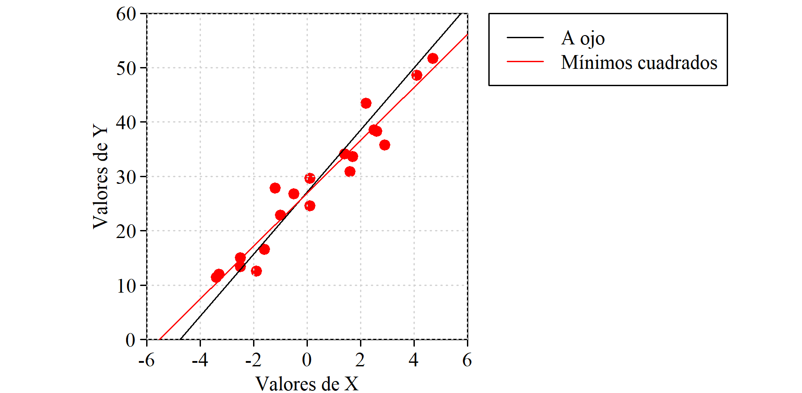
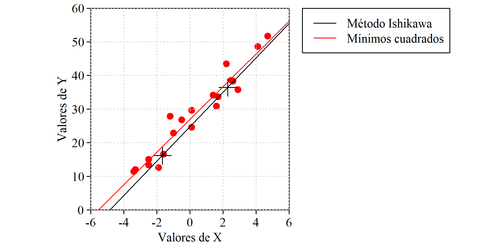
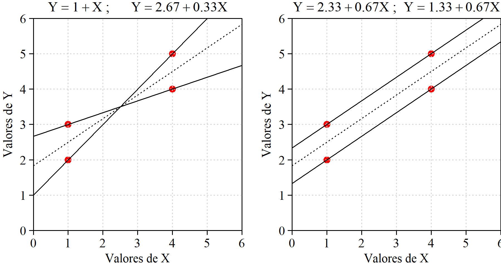
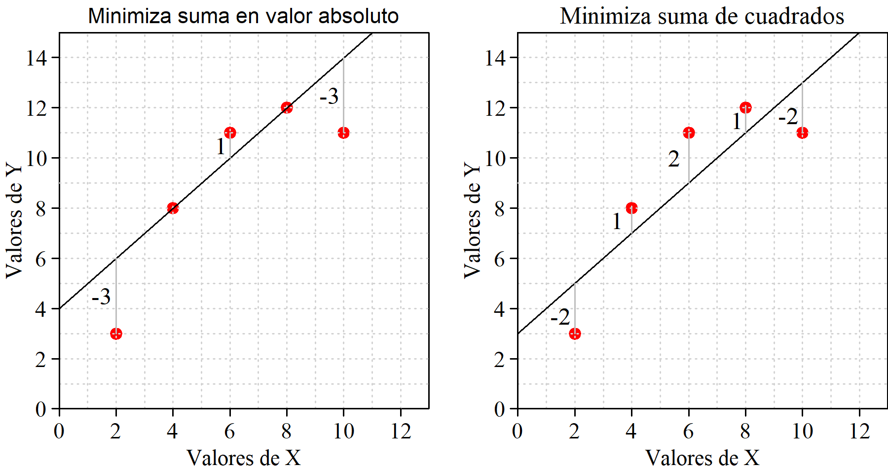
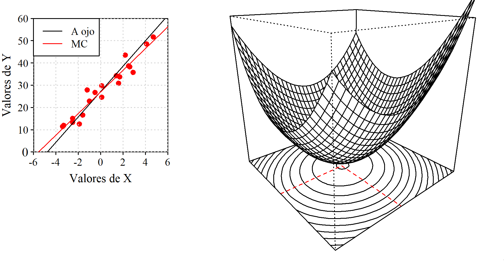

# Regresión Simple

## Definiciones

Residuos

Normalidad de la respuesta

Estimación de los parámetros

Modelo, no ecuación

Regresión simple vs. múltiple

## Determinación de la recta ajustada

Se realiza con el objetivo de minimizar la suma de los cuadrados de los residuos. Pero existen otros métodos. Veamos algunos.

### A ojo {.unnumbered}

Se traza la recta directamente sobre el papel o se identifican dos puntos de paso y a partir de ellos se calculan los coeficientes del modelo.

A pesar de sus evidentes limitaciones, si solo se trata de tener la recta no es un método tan malo como parece. Con un poco de práctica el ajuste no será muy distinto del "perfecto" y no se cometeran errores de bulto debido a la presencia de valores anómalos, cosa que sí puede ocurrir si se tratan los datos de forma automática sin mnirarlos.

{#fig-sumaCero fig-align="right" width="100%"}

+--------------------------------------------------------------------------------+----------------------------------------------------------------------------------------+
| **PROS** <i class="fa-solid fa-thumbs-up fa-xl" style="color: #0ca701;"></i>   | -   Intuitivo. Muy fácil de entender                                                   |
|                                                                                | -   No se comenten errores de mucho bulto                                              |
+--------------------------------------------------------------------------------+----------------------------------------------------------------------------------------+
| **CONS** <i class="fa-solid fa-thumbs-down fa-xl" style="color: #f03333;"></i> | -   No se logra el ajuste "perfecto" de acuerdo con el criterio establecido            |
|                                                                                | -   No se tienen medidas de calidad del ajuste ni de significación de los coeficientes |
|                                                                                | -   Solo sirve para regresión simple                                                   |
+--------------------------------------------------------------------------------+----------------------------------------------------------------------------------------+

: {tbl-colwidths="\[10,90\]"}

### Método de Ishikawa {.unnumbered}

Aquí texto,

{#fig-Ishikawa fig-align="right" width="100%"}

+--------------------------------------------------------------------------------+---------------------------------------------------------------------------------+
| **PROS** <i class="fa-solid fa-thumbs-up fa-xl" style="color: #0ca701;"></i>   | -   Fácil de entender                                                           |
|                                                                                | -   Robusto frente a la presencia de valores anómalos o con excesiva influencia |
+--------------------------------------------------------------------------------+---------------------------------------------------------------------------------+
| **CONS** <i class="fa-solid fa-thumbs-down fa-xl" style="color: #f03333;"></i> | -   No se tienen medidas de calidad del ajuste                                  |
|                                                                                | -   Solo sirve para regresión simple                                            |
+--------------------------------------------------------------------------------+---------------------------------------------------------------------------------+

: Método de Ishikawa. Ventajas e inconvenientes {#tbl-letters} : {tbl-colwidths="\[10,90\]"}

### Minimizando la suma de los residuos {.unnumbered}

Entendemos que se trata de minimizar la suma en valor absoluto, ya que un valor muy grande con signo negativo se logra simplemente aumentando los valores de $b_0$ y/o de $b_1$. Por tanto, se trata de minimizar $|\sum(Y_i - (b_0 - b_1 X_i))|$. Haciendo esta expresión igual a cero (mínimo valor posible), tenemos:

$$ n\bar{Y} - nb_0 - b_1 n \bar{X} = 0$$ Por tanto, con cualquier par de valores $b_0$ y $b_1$ que verifiquen la expresión $\bar{Y} = b_0 + b_1 \bar{X}$, es decir, con cualquier recta que pase por ($X_0$, $Y_0$) tendremos una suma de residuos en valor absoluto igual a cero.

Que haya infinitas rectas que cumplan esa condición ya es mala señal, porque seguro que no todas son adecuadas. Para los valores representados en la figura X tenemos que $\bar{X}= 6$ y $\bar{Y}= 9$. Rectas que cumplen la condicion de minimizar la suma de los residuos son, por ejemplo, la que tiene coeficientes $b_0=9$ y $b_1=0$, es decir: $Y = 9$, o también $b_0 = 12$ y $b_1 = -0.5$, es decir: $Y = 12 -0.5X$.

{#fig-sumaVAbsoluto fig-align="center" width="100%"}

+--------------------------------------------------------------------------------+-----------------------------------------------------------------------------------------------------+
| **PROS** <i class="fa-solid fa-thumbs-up fa-xl" style="color: #0ca701;"></i>   | -   Ninguna                                                                                         |
+--------------------------------------------------------------------------------+-----------------------------------------------------------------------------------------------------+
| **CONS** <i class="fa-solid fa-thumbs-down fa-xl" style="color: #f03333;"></i> | -   Da un número infinito de soluciones (una de ellas coincide con el ajuste por mínimos cuadrados) |
+--------------------------------------------------------------------------------+-----------------------------------------------------------------------------------------------------+

: Minimizar la suma de los residups. Ventajas e inconvenientes {#tbl-letters} : {tbl-colwidths="\[10,90\]"}

### Minimizando la suma de los residuos en valor absoluto {.unnumbered}

De entrada parece bastante más razonable que el anterior. Puede no tener solución única, pero los resultados que da no son disparados como en el caso anterior \***referencia a figura\***. Tiene solución única pero no existen expresiones para los coeficientes debido a las dificultades en el manejo de la función "valor absoluto".

{fig-align="center" width="100%"}

Mas información: [Wikipedia](abline(out$coefficients%5B1%5D,%20out$coefficients%5B2%5D) "Más información")

### Minizando la suma de los cuadrados de los residuos {.unnumbered}

aquí texto

{#fig-sumaCuadrados fig-align="center" width="100%"}

## Mínimos cuadrados. Cálculo de los coeficientes

Aquí texto

### Con fuerza bruta {.unnumbered}

Podemos hacer una primera estimación de los coeficientes a ojo, y mediante un pequeño programa -o también usando una hoja de cálculo- realizar un barrido de la suma de los cuadrados de los residuos que se obtienen con valores de b0 y b1 en torno a los estimados, identificando el par de valores que minimiza esa suma de cuadrados.

Natrualmente, es mucho más rápido y más práctico echar mano de las fórmulas para b0 y b1 o -mejor todavía- usar un paquete de software o una hoja de cálculo que los da de forma automática, pero hacerlo a mano permite entender perfectamente qué es lo que se está haciendo, y también descubrir algún detalle interesante.

Vayamos a los datos de la figura @fig-sumaCero (que son también los de @fig-Ishikawa). La recta ajustada a ojo pasa por los puntos (-4,75; 0) y (5,75, 60) y es inmediato deducir que $b_1$ = 5,71 y $b_0$ = 27,14. Sería mucha casualidad que esos fueran los valores de los coeficientes que minimizan la suma de los cuadrados de los residuos, pero seguramente no andarán muy lejos. Vamos a crear una malla de valores de $b_0$ y $b_1$. Los valores de b0 variarán de 2 a 8 con incrementos de 0,1 y para cada uno de esos, los de b0 irán de 20 a 35 también en saltos de 0,1. Cada combinación de estos dos valroes corresponde a una recta, y a cada recta le corresponde una suma de los cuadrados de los residuos. Vamos a ver cual es el par de valores bo, b1 que minimiza la suma de los cuadrados de los residuos.

{#fig-fuerzaBruta fig-align="center" width="100%"}

### Usando las fórmulas{.unnumbered}

Curiosidad con el redondeo

## Calidad del ajuste

R2

## Las cosas se complican: Lo que tenemos es una muestra

### Condiciones que deben reunir los datos{.unnumbered}

Cuanto más pedimos a los datos, más exigentes debemos ser con las condiciones que deben cumplir.

See @knuth84 for additional discussion of literate programming.
